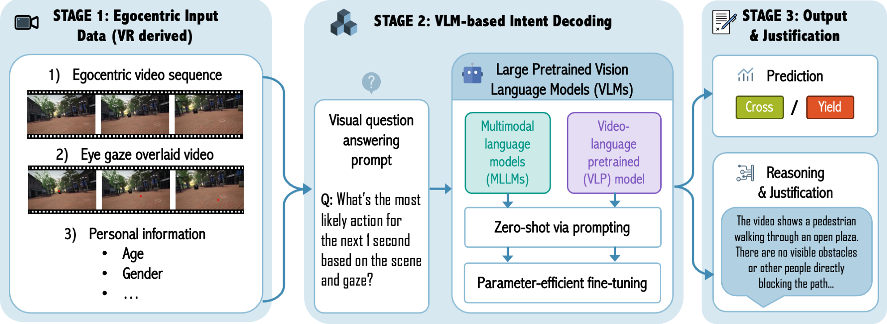

# EgoCross-VLM

<p align="left">
  <a href="https://arxiv.org/abs/2606.09142"></a>
  <a href="https://egocross-vlm.github.io"></a>
</p>

This is the implementation of the paper titled **"Decoding Pedestrian Crossing Intention from Egocentric Vision via Vision Language Models."**

Predicting whether a pedestrian is about to cross the street from **egocentric, first-person video**. We frame this as a Visual Question Answering (VQA) task and evaluate how well pretrained Vision-Language Models (VLMs) can reason about crossing intention, in both zero-shot and fine-tuned settings — benchmarked against a suite of dedicated deep-learning baselines.

<p align="center">
  
</p>

## Contents

<!-- - [Overview](#overview) -->
- [Installation](#installation)
- [Usage](#usage)
  - [VLM zero-shot evaluation](#1-vlm-zero-shot-evaluation)
  - [VLM fine-tuning (LoRA)](#2-vlm-fine-tuning-lora)
  - [DL baselines](#3-dl-baselines)
- [Results](#results)
- [Project Structure](#project-structure)
- [Data Preparation](#data-preparation)
- [Citation](#citation)

<!-- ## Overview

**Key approaches**
- **Zero-shot VLM evaluation** — Qwen3-VL (2B/4B/8B) prompted with several chain-of-thought (CoT) variants, with and without video/context input.
- **LoRA fine-tuning** — adapts Qwen3-VL to the task; supports sequential auxiliary-task pretraining by merging a prior adapter before attaching a fresh LoRA.
- **DL baselines** — LSTM / Transformer / Cross-Attention fusion models over a CLIP or CNN visual backbone, optionally combined with multimodal scalar signals (head pose, gaze, motion, velocity, goal).
- A full **data preparation pipeline**: annotation generation, train/val/test splitting, video resizing, per-clip slicing, and optional gaze overlays. -->

## Installation

```bash
conda create -n pedintent python=3.11
conda activate pedintent
pip install -r requirements.txt
```

Requirements: Python 3.11, CUDA 12.1+, 16GB+ GPU memory recommended for VLM inference.

For determinism, training scripts set the following automatically (no manual action needed):
```bash
export CUBLAS_WORKSPACE_CONFIG=:4096:8
```

## Usage

### 1. VLM zero-shot evaluation

```bash
python -m training.eval_qwen \
    --ann_file features/annotations.VRbinary__crossing_intention__test_close.json \
    --video_root data/videodata_256/clips \
    --cot_type cot4 \
    --model_name Qwen/Qwen3-VL-2B-Instruct \
    --log_dir logs/qwen_eval
```

Always specify `--cot_type` (`none`, `cot1`–`cot7`), `--ann_file` (selects question format via the `groundvqa_qnX` variant), and `--video_root` (use `clips_overlay` for gaze-overlay videos).

Outputs land in `<outdir>/<timestamp>_responses.json` (predictions) and `<timestamp>_responses_report.json` (metrics). If automatic answer parsing fails:
```bash
python -m utils.parser.extract_answers --logdir logs/qwen_eval/<run_dir>
```

### 2. VLM fine-tuning (LoRA)

```bash
python -m training.train_qwen \
    --ann_file_template features/annotations.VRbinary__crossing_intention__mode_close.json \
    --ft_type lora_llm_vlm_bridger \
    --model_name Qwen/Qwen3-VL-2B-Instruct \
    --epochs 10 --batch_size 2 --lr 1e-4
```

The `mode` placeholder in `--ann_file_template` is filled in with `train`/`val`/`test` automatically. `--ft_type` controls which modules get LoRA adapters (`lora_llm_attn_qv`, `lora_llm_attn_qkvo`, `lora_llm_mlp`, `lora_llm_attn_mlp`, `lora_llm_vlm_bridger`, `lora_vlm_bridger`).

Checkpoints are saved to `logs/qwen_training_<task>/<model_name>/<timestamp>/`. To evaluate a trained adapter:

```bash
python -m training.train_qwen \
    --ann_file_template features/annotations.VRbinary__crossing_intention__mode_close.json \
    --adapter_ckpt_path logs/qwen_training_intention/Qwen3-VL-2B-Instruct/<timestamp> \
    --ft_type lora_llm_vlm_bridger \
    --mode eval
```

### 3. DL baselines

```bash
python -m training.train_dl --config config/train_dl.yaml
```

Model architecture (`lstm`/`transformer`/`cross_attention`), visual backbone (`clip`/`cnn`/`pixels`), annotation paths, and hyperparameters are all set in the YAML config (see `config/`). With `egocentric_only: true`, only visual frames are used — no CSV-based multimodal signals.

## Results

<table>
<thead>
<tr><th rowspan="2">Stage</th><th rowspan="2">Method</th><th colspan="2">Input</th><th rowspan="2">Accuracy</th><th rowspan="2">Macro-F1</th></tr>
<tr><th>Egocentric</th><th>Gaze-guided</th></tr>
</thead>
<tbody>
<tr><td>Baseline</td><td>CLIP+Transformer baseline</td><td>✅</td><td></td><td>0.727</td><td>0.724</td></tr>
<tr style="border-top:2px solid"><td>Zero-shot</td><td>VLM (Qwen2.5-VL-7B, standard prompt)</td><td>✅</td><td></td><td>0.629</td><td>0.575</td></tr>
<tr><td></td><td>VLM (Qwen2.5-VL-7B, standard prompt)</td><td>✅</td><td>✅</td><td>0.663</td><td>0.646</td></tr>
<tr><td></td><td>VLM (Qwen3-VL-2B, standard prompt)</td><td>✅</td><td></td><td>0.591</td><td>0.578</td></tr>
<tr style="border-top:2px solid"><td>Fine-tuned</td><td>VLM (Qwen3-VL-2B, LoRA)</td><td>✅</td><td></td><td>0.755</td><td>0.742</td></tr>
<tr><td></td><td>VLM (Qwen3-VL-2B, LoRA)</td><td>✅</td><td>✅</td><td><strong>0.834</strong></td><td><strong>0.830</strong></td></tr>
<tr><td></td><td>VLM (GroundVQA, LoRA)</td><td>✅</td><td></td><td>0.788</td><td>0.786</td></tr>
</tbody>
</table>


## Project Structure

```
EgoCross-VLM
├── dataprep/       # Annotation prep, train/val/test splits, video resize/slice/overlay
├── features/        # Pre-extracted features and per-variant VQA annotation JSONs
├── models/           # LSTM / Transformer / Cross-Attention fusion architectures + backbones
├── training/         # train/eval entrypoints for VLM (Qwen) and DL pipelines
├── utils/            # Shared utilities: dataset classes, result analysis, gaze/CoT analysis, parsers
├── config/            # YAML configs for DL training and Optuna hyperparameter tuning
├── scripts/           # Shell scripts for evaluation sweeps and ablation studies
├── notebooks/         # Exploratory and visualization notebooks
├── data/              # Raw/processed video and annotation data (git-ignored)
├── logs/               # Training/eval logs and checkpoints
├── results/            # Result tables, plots, ablation summaries
└── tests/               # Unit tests
```


## Data Preparation

You can use directly the provided annotation files. Use this only if you want to prepare from the raw data. 

```bash
python dataprep/d1prepare_annos.py --problem_type qa   # build QA annotation JSONs
python -m dataprep.d2split_annos                        # person-level train/val/test split
python dataprep/v1video_resize.py                       # resize clips to 256px
python dataprep/v2extract_videoslice.py                 # extract per-annotation video slices
python dataprep/v3overlay_gaze.py                       # (optional) adds gaze overlays to raw videos
```

Annotation files follow the convention:
```
features/annotations.VRbinary__crossing_intention__<split>_close.json
```
- `<split>`: `train`, `val`, `test`, `full`


## Citation

```bibtex
@article{li2026decoding,
  title={Decoding Pedestrian Crossing Intention from Egocentric Vision via Vision Language Models},
  author={Li, Danya and Su, Xiang and Feng, Yan and Krueger, Rico},
  journal={arXiv preprint arXiv:2606.09142},
  year={2026}
}
```

## Acknowledgments

Thanks to [VideoMAE](https://github.com/MCG-NJU/VideoMAE) and [EgoVLP](https://github.com/facebookresearch/EgoVLP) for feature extraction, [GroundVQA](https://github.com/enguangzhang/GroundVQA) for the VLP framework, and [Qwen3-VL](https://github.com/QwenLM/Qwen-VL) for pretrained VLMs.
